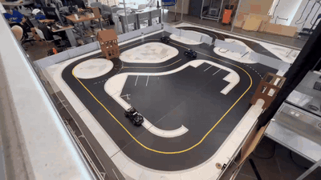

<div align="center">

# 🏁 RoboRacer · QCar 1 — Autonomous Racing Stack

### Integración de Percepción, Planeación y Control en un vehículo autónomo a escala 1:10

**Tecnológico de Monterrey, Campus Puebla** · Bloque de Integración Final

Alfonso Solís Díaz · Emmanuel Lechuga Arreola
Profesores: A. Daniel Sosa-Cerón, Ph.D. · Jorge A. Reyes-Avendaño, Ph.D.



*QCar físico: sigue el carril por visión, detecta los obstáculos y los bordea sin colisión, retomando la línea (×6).*

[**▶ Ver demo en simulación (RViz · Pure Pursuit)**](https://github.com/AldonDC/roboracer-autonomous-stack/raw/main/docs/assets/demo_rviz.webm)

</div>

---

## 🎯 Resumen del proyecto

**RoboRacer** es una competencia de carreras autónomas a escala **1:10**, cabeza a cabeza. No
basta con ir rápido: el vehículo debe **evadir obstáculos y no chocar**. El reto es **integrar
percepción + planeación + control en tiempo real** sobre cómputo embebido.

> **En una frase:** el carro debe **ver**, **decidir** y **moverse** solo, rápido y sin golpear nada.

Lo resolvimos en **dos frentes complementarios**, ambos con la misma arquitectura modular en ROS 2:

| | 🖥️ **Parte A — Simulado** | 🏎️ **Parte B — Físico** |
|---|---|---|
| **Entorno** | Gazebo Harmonic + RViz | Hardware real Quanser QCar 1 + Jetson |
| **Control** | Pure Pursuit adaptativo + perfiles de velocidad | Pure Pursuit + lookahead dinámico (50 Hz) |
| **Evasión** | Campos de Potencial Artificial (APF) | FSM de evasión + fusión visión–LIDAR |
| **Percepción** | Lane Detection dual-color + STOP signs | BEV + ajuste polinomial + LIDAR + profundidad |
| **Navegación** | Multi-waypoint vía RViz (2D Nav Goal) | Seguimiento de carril continuo |
| **Logro** | Time-trials, evasión dinámica, señales de alto | Recorrido autónomo + evasión sin colisión ✅ |

| | |
|---|---|
| **Plataforma** | Quanser QCar 1 — LIDAR 2D, cámara RGB-D Intel RealSense D435, NVIDIA Jetson |
| **Dirección** | Ackermann, $L = 0.256$ m, $\delta_{\max} \approx 30°$ |
| **Middleware** | ROS 2 (Jazzy) · DDS FastRTPS · Gazebo Harmonic |
| **Cómputo** | Visión clásica 320×240, control 50 Hz, sin DNN |

---

## 🧮 Fundamento común: modelo cinemático Ackermann

Ambas partes comparten el mismo modelo del vehículo. El QCar usa **dirección Ackermann**, que se
modela con la **bicicleta cinemática**:

$$\dot\psi = \frac{v}{L}\tan\delta \qquad\qquad R = \frac{L}{\tan\delta}$$

donde $v$ es la velocidad lineal, $\delta$ el ángulo de giro de las llantas, $\psi$ la orientación
(yaw), $L$ la distancia entre ejes y $R$ el radio de giro instantáneo. **Más velocidad o más giro
⇒ curva más cerrada** (menor $R$).

**Restricciones medibles:** $L = 0.256$ m · $\delta_{\max} \approx 30°$ · LIDAR cono 90° válido
0.15–5 m · cámara D435 FOV 69° · velocidad 0.08–0.18 m/s · zona muerta del motor ≈ 0.12.

---
---

# 🖥️ PARTE A — SIMULADO (Gazebo + RViz)

> **Qué se logró:** un ecosistema de simulación hiperrealista donde el QCar completa *time-trials*
> por waypoints, evade obstáculos dinámicos con campos de potencial, detecta líneas de carril por
> visión y se detiene ante señales de alto. Todo orquestado desde RViz con un solo launcher.

## A.1. Arquitectura del sistema (Gazebo + RViz)

### Migración de la pista a Gazebo
Para un entorno de pruebas hiperrealista, se recreó la pista oficial dentro de **Gazebo Harmonic**:
* **Mesh 3D (`qcar_track.obj`)**: modelo 3D exacto de la pista con texturas (`SDCS_MapLayout.png`).
* **Mundo (`test_world.sdf`)**: plugins físicos nativos (`dartsim`), pista estática + barreras perimetrales.
* **Sincronización:** Gazebo procesa físicas a 1000 Hz y expone la odometría del QCar a ROS 2 vía `ros_gz_bridge`.

### Visualización profesional en RViz
* `odom_tf_broadcaster.py`: traduce la odometría plana de Gazebo a transformaciones TF (`world` → `base_link`), moviendo el carro en RViz en tiempo real.
* `track_visualizer.py`: extrae los vértices del `.obj` de la pista y los transmite como `Marker` a RViz.

### Oschersleben Pro (v15.0)
* **Mesh de alta densidad**: entorno 100% offline (`track.obj`), sin dependencias de red.
* **Safety Cars F1TENTH**: obstáculos basados en las mallas originales del simulador F1TENTH (`chassis.stl`, `wheels`, `hokuyo`).
* **Física y offsets**: los obstáculos respetan los XACRO offsets originales para detección láser precisa.

---

## A.2. Control: Pure Pursuit adaptativo

El seguimiento de ruta (waypoint navigation) usa una variante del **algoritmo Pure Pursuit**,
adaptada a dirección Ackermann. El objetivo es el ángulo de giro $\delta$ que mantenga al carro
sobre un arco que intersecte un objetivo a una distancia $L_d$ (lookahead):

$$\delta = \arctan\!\left(\frac{2L \sin(\alpha)}{L_d}\right)$$

donde $\alpha$ es el ángulo entre el heading actual y el waypoint, $L = 0.256$ m y $L_d$ la
distancia de mirada al frente.

### Perfiles de velocidad inteligentes

**1) Límite por curvatura** — la velocidad se reduce inversamente al ángulo de dirección:

$$V(\delta) = \frac{V_{ref}}{1 + k\,|\delta|}$$

con $V_{ref}$ la velocidad de crucero base, $k$ la ganancia de penalización en curvas y $|\delta|$
la magnitud del giro actual.

**2) Perfil de arribo (S-Curve)** — desaceleración suave por raíz cuadrada de la distancia al
objetivo, evitando oscilación cerca del waypoint:

$$V_{dist} = V_{ref}\cdot\sqrt{\max\!\left(0.2,\;\frac{d}{d_{range}}\right)}$$

con $d$ la distancia euclidiana al waypoint activo y $d_{range}$ el radio de desaceleración.

**3) Filtro de jerk** — la aceleración se limita a $0.08\,\mathrm{m/s^2}$ para proteger los
actuadores y evitar deslizamiento de neumáticos.

---

## A.3. Evasión de obstáculos: Artificial Potential Fields (APF)

El entorno se modela como un terreno de energías. La fuerza resultante es el gradiente negativo del
potencial total (atractivo + repulsivo):

$$\mathbf{F}_{net} = -\nabla U_{att}(\mathbf{q}) - \nabla U_{rep}(\mathbf{q})$$

La contribución repulsiva de cada cluster de obstáculos detectado por el láser:

$$\mathbf{F}_{rep} = \begin{cases} \eta \left( \dfrac{1}{\rho(\mathbf{q})} - \dfrac{1}{\rho_0} \right) \dfrac{1}{\rho^2(\mathbf{q})} \dfrac{\mathbf{q} - \mathbf{q}_{obs}}{\rho(\mathbf{q})} & \text{si } \rho(\mathbf{q}) \leq \rho_0 \\[2mm] 0 & \text{si } \rho(\mathbf{q}) > \rho_0 \end{cases}$$

donde $\eta$ es la ganancia de evasión, $\rho(\mathbf{q})$ la distancia al obstáculo más cercano,
$\rho_0$ el radio de influencia y $\mathbf{q}-\mathbf{q}_{obs}$ el vector relativo obstáculo→robot.

**Evasión dinámica (2D Nav Goal):** desde RViz el operador coloca objetos físicos reales en
Gazebo. El sistema intercepta el clic, *spawnea* un cubo rojo, y el carro lo detecta por LiDAR y
cámara.

---

## A.4. Visión artificial activa — Lane Detection (v13)

El nodo `lane_detector.py` procesa la cámara `csi_front` con OpenCV y fusiona el resultado con APF
y Pure Pursuit para un **control de tres capas**.

**Semántica de la pista:** línea **amarilla** = divisoria central (borde izquierdo del carril
propio); borde **blanco/gris** = borde derecho. El detector estima el **centro del carril**
$c_{lane}$ a partir de ambos bordes.

**Pipeline OpenCV (5 etapas a 30 Hz):** BGR→HSV → doble máscara HSV (amarillo + blanco) →
apertura/cierre morfológico (kernel 5×5) → ROI trapezoidal → Canny + `HoughLinesP` + ajuste de
recta por mínimos cuadrados.

Doble máscara binaria, una por color objetivo:

$$M_{yellow}(p) = [\,H(p)\in[18,38] \wedge S(p)\in[80,255] \wedge V(p)\in[80,255]\,]$$
$$M_{white}(p) = [\,S(p)\le 80 \wedge V(p)\ge 140\,]$$

**Centro de carril (fusión)** según las detecciones disponibles:

$$c_{lane} = \begin{cases} \frac{x_Y + x_W}{2} & \text{ambas líneas} \\ x_Y + w_{lane} & \text{solo amarillo} \\ x_W - w_{lane} & \text{solo blanco} \\ \text{ninguna} & \text{sin estimación} \end{cases}$$

con $x_Y, x_W$ las posiciones X de las líneas amarilla/blanca y $w_{lane}$ el ancho medio de carril
(fallback). Niveles de confianza: ambas = 1.00, solo amarillo = 0.70, solo blanco = 0.55, ninguna = 0.00.

**Offset normalizado** publicado en `/lane/center_offset`, con suavizado exponencial:

$$o = \mathrm{clip}\!\left(\frac{c_{lane}-w/2}{w/2},\,-1,\,+1\right), \qquad o_t = 0.7\,o_{t-1} + 0.3\,\tilde{o}_t$$

**Fusión en el controlador (Lane-Assist):** el `multi_goal_navigator` inyecta una corrección
lateral en el steering, pero **solo cuando el APF no está en emergencia** (LiDAR siempre manda):

$$\delta_{final} = \delta_{PP} + \delta_{APF} + \delta_{lane}, \qquad \delta_{lane} = \begin{cases} k_{lane}\cdot o \cdot \mathrm{conf} & \text{si } \mathrm{conf} > 0.25 \\ 0 & \text{en otro caso} \end{cases}$$

---

## A.5. Nodos del simulador (`roboracer_racing`)

| Nodo | Funcionalidad |
|---|---|
| `multi_goal_navigator.py` | Planner & controller: Pure Pursuit + APF + Lane-Assist, spawner de obstáculos en Gazebo, parada inteligente ante señales de alto. |
| `lane_detector.py` | Visión activa: doble máscara HSV (amarillo/blanco) + detección de señales rojas. |
| `telemetry_dashboard_fast.py` | Estación de ingeniería PyQtGraph (60+ FPS): fusión LiDAR–cámara + STOP HUD. |
| `odom_tf_broadcaster.py` | Puente espacial Gazebo → TF tree (`world` → `base_link`). |
| `track_visualizer.py` | Exporta el mesh de la pista a RViz como `Marker`. |
| `keyboard_teleop.py` | Conducción manual WASD para validación. |

---

## A.6. Cómo correr el simulador

```bash
# Terminal 1 — Entorno Pro (menú interactivo: Gazebo + RViz + telemetría + visión)
cd ~/Documents/Assesment-Auto
./scripts/launch_pro.sh

# Terminal 2 — Cerebro autónomo
source /opt/ros/jazzy/setup.bash
cd ~/Documents/Assesment-Auto && source install/setup.bash
ros2 run roboracer_racing multi_goal

# (Opcional) Terminal 3 — Debug del lane detector
ros2 run rqt_image_view rqt_image_view /lane/image_debug
```

**Interacción en RViz:** usa **Publish Point** para colocar waypoints (esferas numeradas), escribe
`g` + Enter en la Terminal 2 para arrancar; usa **2D Nav Goal** para *spawnear* un obstáculo
físico; `s` guarda la ruta, `c` limpia.

---
---

# 🏎️ PARTE B — FÍSICO (Hardware QCar + Jetson)

> **Qué se logró:** el QCar real (ver GIF arriba) **sigue el carril por visión, detecta los
> obstáculos y los evade sin colisión**, retomando la línea — validado en pista cerrada con
> obstáculos estáticos. El paquete vive en [`physical_qcar/`](physical_qcar/).

## B.1. Arquitectura: sensores → percepción → planeación → control → actuación

Cada bloque es un nodo ROS 2 independiente; si uno falla, los demás siguen.

```
   SENSORES            PERCEPCIÓN            PLANEACIÓN          CONTROL        ACTUACIÓN
┌────────────┐      ┌──────────────┐      ┌──────────────┐                  ┌────────────┐
│  LIDAR 2D  │─────▶│lidar_processor│────▶│ gap_follower │──┐               │ user_cmd   │
├────────────┤      ├──────────────┤      ├──────────────┤  │  ┌─────────┐  ├────────────┤
│RealSense   │─────▶│depth_processor│──┐  │ FSM evasión  │──┴─▶│  Pure   │─▶│ Motor +    │
│  D435      │      ├──────────────┤  └─▶│  + fusión    │     │ Pursuit │  │ Servo      │
├────────────┤      │              │     └──────────────┘     └─────────┘  │  (v, δ)    │
│  Cámara    │─────▶│ lane_detector │────────────▲                          └────────────┘
└────────────┘      └──────────────┘
```

**Decisiones de diseño:** percepción por **fusión** (cámara+LIDAR+profundidad, más robusta) ·
planeación **híbrida** · control **Pure Pursuit** (ligero, cabe a 50 Hz) · decisión por **FSM**
(predecible y fácil de depurar). Criterio: viabilidad, robustez y costo de cómputo embebido.

---

## B.2. Percepción: del pixel al "a dónde ir"

`lane_detector.py`: `Imagen → CLAHE → Máscara amarilla (HSV/HLS) → Vista de pájaro (BEV) → Punto objetivo`

* **CLAHE** — realza el contraste para que la línea resalte aunque cambie la luz.
* **BEV** — *endereza* la imagen como vista cenital libre de perspectiva (homografía).
* **Ajuste polinomial** — parábola de 2° grado por carril, suavizada con **filtro EMA**.
* **Punto objetivo** — coordenada $(x,y)$ en metros de a dónde ir.

**Percepción de distancia (fusión de 3 fuentes):**
* **LIDAR** (`lidar_processor.py`) — cono frontal de 90°; usa un **percentil**, no el mínimo, para no frenar por un punto aislado.
* **Profundidad** (`depth_processor.py`) — cuenta píxeles cercanos de la RealSense D435; confirma el obstáculo (sin DNN, NumPy vectorizado).
* **Círculo de seguridad** — si algo entra muy cerca, **paro inmediato**.

Ángulo del LIDAR por índice y obstáculo más cercano dentro del cono:

$$\theta_i = (-1)^{\text{flip}}(\theta_{\min} + i\,\Delta\theta) + \theta_{\text{offset}}, \qquad i^\* = \arg\min_{i\in\text{front}} r_i$$

---

## B.3. Control: Pure Pursuit con lookahead dinámico

**Idea (como un conductor):** fija la vista en un punto del carril más adelante y gira hacia él.

$$\delta = \operatorname{atan2}\!\big(2L\sin\alpha,\; l_d\big), \qquad l_d = 0.5\,S_{\text{base}} + 0.4\,v$$

Más rápido ⇒ **mira más lejos** (trayectoria más suave); en curva cerrada **baja la velocidad**
automáticamente; con **tope de seguridad** y **compensación de la zona muerta** del motor.

**Safety LIDAR integrado:** `d < 0.6 m` → freno total · `d < 1.5 m` → velocidad ×0.4 · sin datos
> 0.5 s → ignora (sensor offline).

---

## B.4. Decisión: FSM de evasión

```
NORMAL ──obst.──▶ REVERSING ──libre──▶ STEER_AWAY ──rebasa──▶ SETTLING ──listo──▶ NORMAL
   ▲                                                                                  │
   └──────────────────────────────── sin obstáculo ──────────────────────────────────┘
```

| Estado | Qué hace |
|---|---|
| **NORMAL** | Sigue el carril. |
| **REVERSING** | Retrocede girando al lado opuesto. |
| **STEER_AWAY** | Avanza esquivando (rebasa). |
| **SETTLING** | Se estabiliza y vuelve al carril. |

---

## B.5. Fusión visión–LIDAR

El giro final **mezcla** dos sugerencias según la distancia al obstáculo:

$$\delta = w\,\delta_{\text{cámara}} + (1-w)\,\delta_{\text{LIDAR}}$$

El peso $w\in[0,1]$ lo decide la distancia: **lejos** → manda la cámara (seguir carril); **cerca**
→ manda el LIDAR (esquivar). El cambio es **suave** (sin brincos), se **adapta a la distancia**
(no un 50/50 fijo) y es **ligero y predecible** vs. un MPC o una red neuronal. El nodo
`gap_follower.py` (Disparity Extender vectorizado) provee $\delta_{\text{LIDAR}}$ con su confianza.

---

## B.6. Nodos del stack físico

**Núcleo:** `lane_detector` · `lidar_processor` · `lane_follower_pp` (Pure Pursuit + FSM + fusión + safety) · `physical_dashboard` · `keyboard_teleop`.

**Complementarios:** `gap_follower` (Disparity Extender) · `depth_processor` (proximidad RealSense)
· `yellow_line_tracker` · `lane_obstacle_avoider` · `qcar_state_estimator` (odometría IMU+tach) ·
`imu_bno055`.

---

## B.7. Cómo correr el físico (resumen)

```bash
# Variables de red (en TODAS las terminales)
export ROS_DOMAIN_ID=115
export RMW_IMPLEMENTATION=rmw_fastrtps_cpp

# Terminal 1 — Jetson: hardware base
ros2 launch roboracer_racing physical_racing.launch.py
# Terminal 2 — Jetson: pipeline autónoma completa
ros2 launch roboracer_racing lane_pursuit.launch.py
# Terminal 3 — Laptop: dashboard de monitoreo
ros2 run roboracer_racing physical_dashboard
```

> 📘 **Guía operativa completa** (red, SSHFS, lanzamiento, mapa de topics, calibración, FSM,
> fusión y todos los módulos) → **[physical_qcar/README_FISICO.md](physical_qcar/README_FISICO.md)**

---
---

## 🛠️ Problemas y soluciones (físico)

| Problema | Solución |
|---|---|
| Zona muerta del motor/servo | Velocidad mínima de motor y signo de servo calibrado. |
| IMU con deriva/ruido | **No usar IMU** en el lazo base: control sobre el punto de visión (marco local). |
| Visión sensible a la iluminación | **CLAHE** + fusión con LIDAR ponderada por confianza. |
| Cómputo limitado del Jetson | **NumPy vectorizado**, *downscale* de profundidad, **sin DNN**. |
| Frenado de más por lectura aislada del LIDAR | Distancia **representativa** (percentil) que ignora puntos sueltos. |

---

## 📊 Resultados

| Escenario | Evasión | Observación |
|---|---|---|
| Seguimiento de carril (físico) | — | Sigue la línea de forma estable. |
| Evasión de obstáculo (físico) | ✅ | Bordea sin colisión y retoma el carril. |
| Time-trial por waypoints (sim) | — | Completa la ruta con Pure Pursuit + perfiles de velocidad. |
| Evasión dinámica (sim) | ✅ | Esquiva obstáculos *spawneados* en Gazebo vía APF. |
| Señales de alto (sim) | ✅ | Se detiene 5 s y reanuda (Behavioral Vision v14). |

El QCar **completó el recorrido, detectó los obstáculos y los esquivó sin chocar**, volviendo al
carril — como se ve en el GIF al inicio (la cámara cenital es solo registro; el carro percibe a bordo).

---

## 🏁 Conclusiones y trabajo futuro

- Una arquitectura **modular en ROS 2** con percepción multimodal y un control geométrico ligero **funciona** tanto en simulación como sobre cómputo embebido real.
- La **fusión visión–LIDAR** logra una transición estable entre seguir el carril y evadir obstáculos.
- Decisiones de ingeniería (no IMU en el lazo base, visión clásica) priorizaron **robustez y simplicidad**.

**Trabajo futuro:** localización con IMU/EKF para un modo de carrera global (`qcar_state_estimator`),
control predictivo (MPC) en hardware más potente, percepción con aprendizaje, y carreras
*head-to-head* con `ghost_car`.

---

## 📂 Estructura del repositorio

```text
roboracer-autonomous-stack/
├── docs/assets/              # GIF del físico + demo RViz (simulación)
├── physical_qcar/            # 🏎️ PARTE B — stack del QCar FÍSICO (Jetson)
│   ├── README_FISICO.md      #    guía operativa completa del despliegue físico
│   └── src/roboracer_racing/ #    nodos, launches y setup del hardware
├── src/                      # 🖥️ PARTE A — stack de SIMULACIÓN
│   ├── racing_logic/         #    🧠 algoritmos (multi_goal_navigator, lane_detector, …)
│   ├── roboracer/            #    🚗 descripción del robot, mundos Gazebo, interfaces
│   └── support/              #    librerías de apoyo
├── simulator/                # mundos, mallas, RViz y configs de Gazebo
├── scripts/                  # launch_pro.sh y helpers de build
└── README.md                 # este documento
```

---

<div align="center">

**RoboRacer · QCar 1** — Tecnológico de Monterrey, Campus Puebla
*Bloque de Integración Final · Integración de Percepción, Planeación y Control*

*"El que no arriesga, no gana la carrera."* 🏁

</div>
